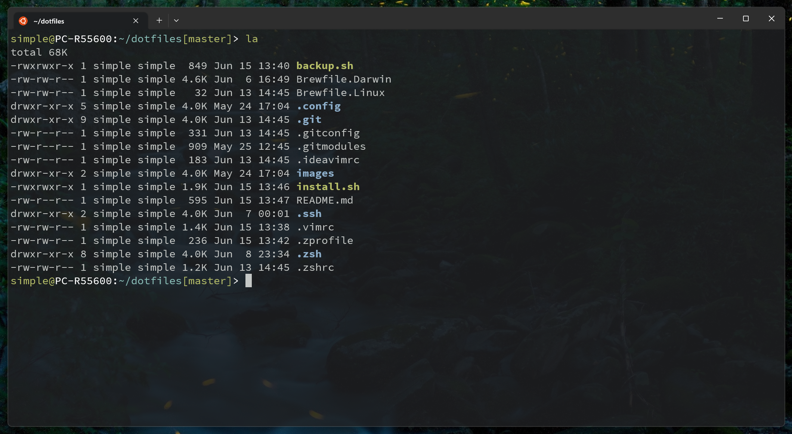
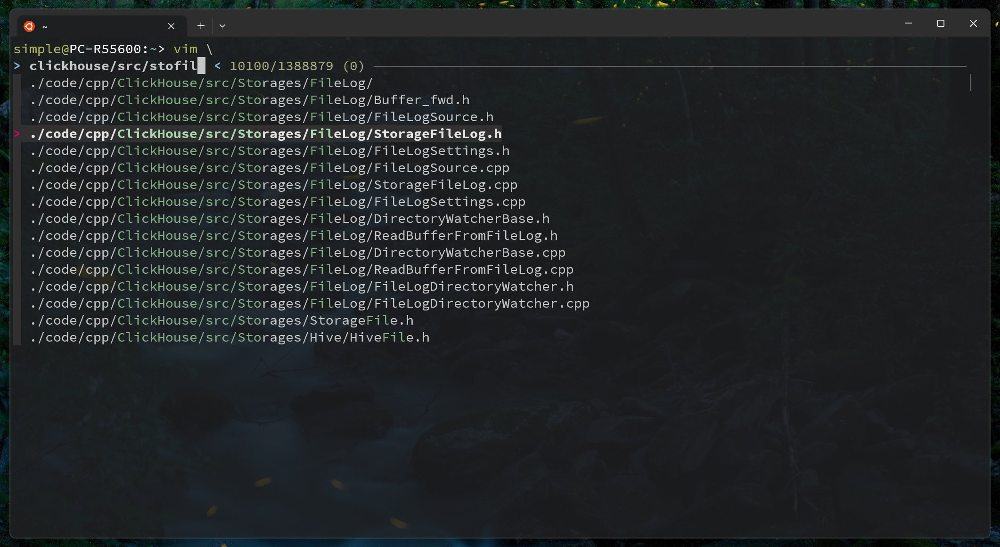
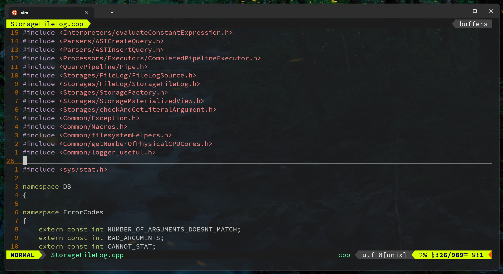

# My Linux / Mac Config... ️

Powered by [dotbot](https://github.com/anishathalye/dotbot) ⚡





# Contents

| item             | config           |
| ---------------- | ---------------- |
| vim config       | `vimrc`          |
| zsh config       | `zshrc`          |
| tmux config      | `tmux.conf`      |
| ssh config       | `.ssh/config`    |
| git config       | `gitconfig`      |
| fzf config       | `zsh/fzf.zsh`    |
| alacritty config | `alacritty.tmol` |

# Quick Start

```shell
git clone https://github.com/Ziy1-Tan/dotfiles.git
cd dotfiles
git submodule update --init --recursive
./install

All targets have been cleaned
...
All paths have been set up
...
All paths have been set up
...
All links have been set up
Install vim-plug (y/[n])

Install fzf
Install brew
All commands have been executed
```

Enjoy!

# Proxy Setup

```shell
host_ip="127.0.0.1"

# before wsl 2.0
# if [ $(uname) = "Linux" ] && $(grep -qi "Microsoft" /proc/version); then
#   host_ip=$(cat /etc/resolv.conf | grep "nameserver" | cut -f 2 -d " ")
# fi

https_proxy=http://$host_ip:7890
http_proxy=http://$host_ip:7890
all_proxy=socks5://$host_ip:7890
export http_proxy https_proxy all_proxy
```
