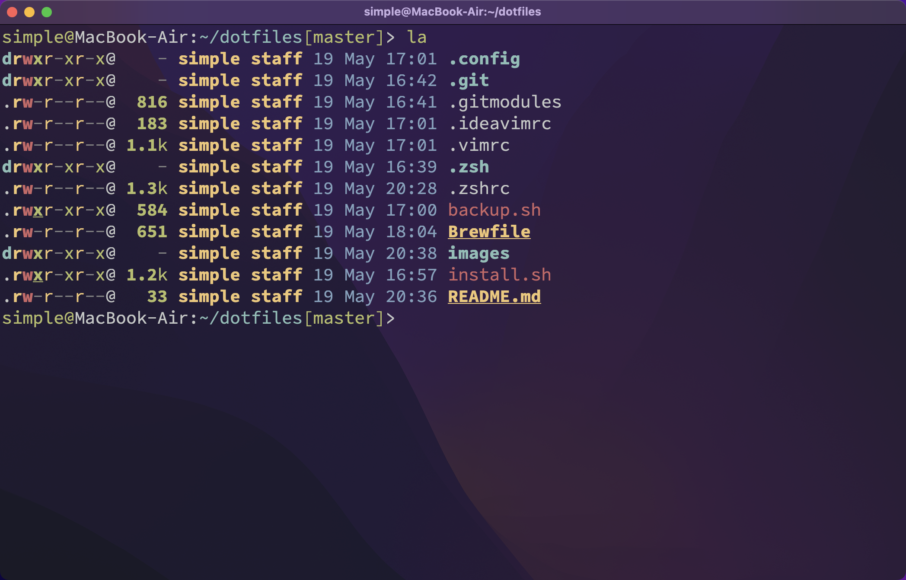

# Ziy1-Tan dotfiles

**Warning:** Don’t blindly use my settings unless you know what that entails. Use at your own risk!

# Contents

- vim config
- zsh config
- alacritty config
- tmux config
- ssh host config
- git config

# Setup

```shell
$ git clone https://github.com/Ziy1-Tan/dotfiles.git
$ cd dotfiles
$ sh ./install.sh

Install to /Users/simple? [y/n] y
...
Finished
```

Enjoy!

# TBD

- [ ] Powered by [yadm](https://github.com/TheLocehiliosan/yadm)
- [ ] Encrypt SSH key 
